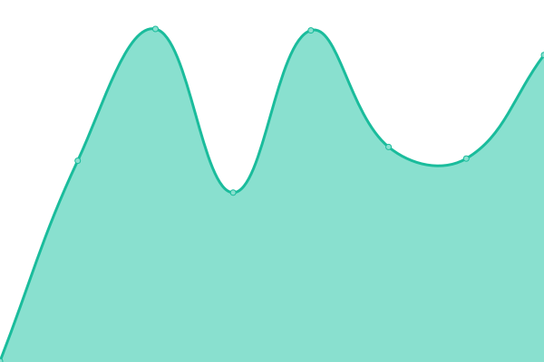
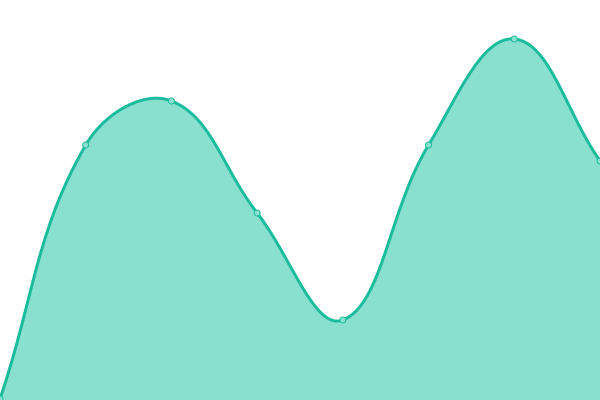
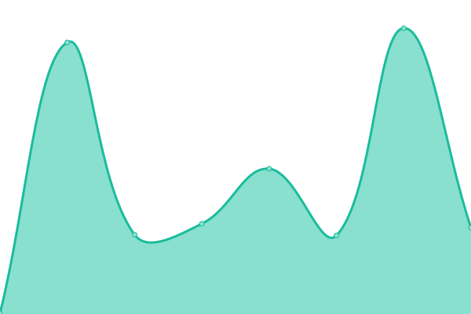

# [📈 Live Status](https://status.momentum-mod.org): <!--live status--> **🟩 All systems operational**

This repository contains the open-source uptime monitor and status page for [Momentum Mod](https://momentum-mod.org), powered by [Upptime](https://github.com/upptime/upptime).

With [Upptime](https://upptime.js.org), you can get your own unlimited and free uptime monitor and status page, powered entirely by a GitHub repository. We use [Issues](https://github.com/momentum-mod/status/issues) as incident reports, [Actions](https://github.com/momentum-mod/status/actions) as uptime monitors, and [Pages](https://status.momentum-mod.org) for the status page.

<!--start: status pages-->
<!-- This summary is generated by Upptime (https://github.com/upptime/upptime) -->
<!-- Do not edit this manually, your changes will be overwritten -->
<!-- prettier-ignore -->
| URL | Status | History | Response Time | Uptime |
| --- | ------ | ------- | ------------- | ------ |
|  [API](https://api.momentum-mod.org/api-docs/) | 🟩 Up | [api.yml](https://github.com/momentum-mod/status/commits/HEAD/history/api.yml) | 

 384ms
     
 | 

<a href="https://status.momentum-mod.org/history/api">100.00%</a>
    

|  [Main Site](https://momentum-mod.org) | 🟩 Up | [main-site.yml](https://github.com/momentum-mod/status/commits/HEAD/history/main-site.yml) | 

 311ms
     
 | 

<a href="https://status.momentum-mod.org/history/main-site">100.00%</a>
    

|  [Docs Site](https://docs.momentum-mod.org) | 🟩 Up | [docs-site.yml](https://github.com/momentum-mod/status/commits/HEAD/history/docs-site.yml) | 

 258ms
     
 | 

<a href="https://status.momentum-mod.org/history/docs-site">100.00%</a>
    

|  [Blog Site](https://blog.momentum-mod.org) | 🟩 Up | [blog-site.yml](https://github.com/momentum-mod/status/commits/HEAD/history/blog-site.yml) | 

 319ms
     
 | 

<a href="https://status.momentum-mod.org/history/blog-site">100.00%</a>
    

<!--end: status pages-->

[**Visit our status website →**](https://status.momentum-mod.org)

## 📄 License

- Powered by: [Upptime](https://github.com/upptime/upptime)
- Code: [MIT](./LICENSE) © [Momentum Mod](https://momentum-mod.org)
- Data in the `./history` directory: [Open Database License](https://opendatacommons.org/licenses/odbl/1-0/)
